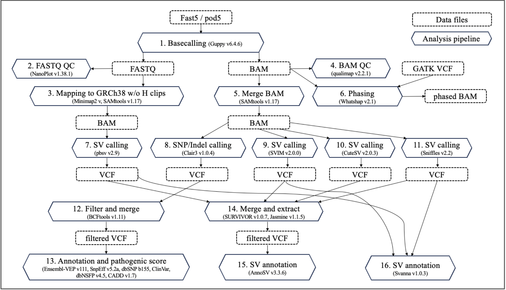

# nanopore-pipline-template

This is a Nanopore analysis pipeline that I developed during my PhD project. The template has been generalized to exclude project-specific information, making it easy to use with any Nanopore data in a Slurm environment. It also includes scripts for analyzing variants, methylation, and other features. However, you will need to manually set the directory paths, generate apptainer files, and download the reference files yourself.

